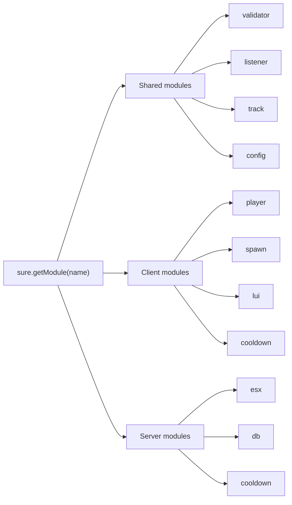

<Frame>
  
</Frame>

# sure_lib

<Badge icon="package" color="white" size="sm">v2.2.1</Badge> <Badge icon="terminal" color="surface" size="sm">Lua 5.4</Badge> <Badge icon="server" color="surface" size="sm">FiveM</Badge>

sure_lib is a modern-first Lua 5.4 utility library for FiveM resources. It gives resource authors focused modules for validation, event safety, reactive state, config loading, entity spawning, cooldown synchronization, database models, ESX transactions, player shortcuts, and Lua-driven NUI rendering.

<CardGroup cols={2}>
  <Card title="Start with installation" icon="rocket" href="scripts/sure_lib/getting-started.mdx">
    Add the shared loader, confirm dependencies, and load your first module.
  </Card>
  <Card title="Understand modules" icon="boxes" href="scripts/sure_lib/module-loader.mdx">
    Learn how `sure.getModule(...)` resolves shared, client, and server modules.
  </Card>
  <Card title="Validate runtime data" icon="shield-check" href="scripts/sure_lib/validator.mdx">
    Build schemas for events, callbacks, configs, and command payloads.
  </Card>
  <Card title="Reference every API" icon="list-check" href="scripts/sure_lib/api-reference.mdx">
    Scan method signatures, parameters, return values, and runtime availability.
  </Card>
  <Card title="Build Lua UI" icon="panels-top-left" href="scripts/sure_lib/lui.mdx">
    Render bundled NUI pages from Lua node trees, reactive state, and motion components.
  </Card>
</CardGroup>

<Info>
  This documentation is written for the latest `sure_lib` repository state at commit `30b3cfd` and resource version `2.2.1`.
</Info>

## Runtime map

## Recommended path

<Steps>
  <Step title="Install the loader">
    Add `shared_script '@sure_lib/init.lua'` to any resource that consumes sure_lib.
  </Step>
  <Step title="Load only what you need">
    Call `sure.getModule('validator')`, `sure.getModule('lui')`, `sure.getModule('db')`, or another module from the side where it exists.
  </Step>
  <Step title="Keep boundaries explicit">
    Use shared modules for cross-side logic, client modules for local player/UI work, and server modules for authoritative database, ESX, or cooldown state.
  </Step>
</Steps>
