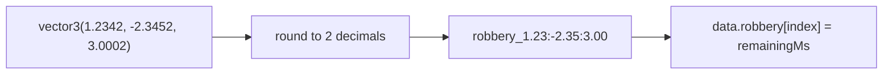

# Cooldown

The `cooldown` module exists on both client and server. The server owns definitions and authoritative state. Clients read synced state, request missing entries, decrement local display values, and ask the server to start or reset cooldowns.

```lua
local cooldown = sure.getModule('cooldown')
```

## Server define

Define each cooldown key on the server before clients request it.

```lua server.lua
local cooldown = sure.getModule('cooldown')

cooldown.define('robbery', {
  initialDurationMs = 0,
  durationMs = 15 * 60 * 1000,
  resetAfterZeroTicks = 60
})
```

<ParamField path="initialDurationMs" type="integer" required>
  The value assigned to a new position entry the first time it is requested.
</ParamField>

<ParamField path="durationMs" type="integer" required>
  The value used when `start(key, position)` is called without an explicit duration.
</ParamField>

<ParamField path="pauseTimerOn" type="integer">
  Optional millisecond value where countdowns pause until an external update changes the value.
</ParamField>

<ParamField path="resetAfterZeroTicks" type="integer">
  Optional number of one-second server ticks to wait at zero before resetting the entry to `durationMs`.
</ParamField>

## Client read and start

```lua client.lua
local cooldown = sure.getModule('cooldown')
local position = GetEntityCoords(PlayerPedId())

local remainingMs = cooldown.getRemaining('robbery', position)

if remainingMs == 0 then
  cooldown.start('robbery', position)
end
```

## Position keys

Cooldown entries are keyed by `key` plus a rounded `vector3` position. Coordinates are rounded to two decimal places on both client and server to avoid floating point drift.



## API by side

<Tabs>
  <Tab title="Server">
    <ParamField path="define(key, definition)" type="function" required>
      Registers a cooldown definition and creates storage for that key.
    </ParamField>
  </Tab>
  <Tab title="Client">
    <ParamField path="getRemaining(key, position)" type="function" required>
      Returns the current local remaining time in milliseconds. If the client has no local entry, it requests the value from the server.
    </ParamField>
    <ParamField path="start(key, position, durationMs?)" type="function" required>
      Sends a server event to start or reset the cooldown entry. `durationMs` overrides the server definition for that update.
    </ParamField>
    <ParamField path="ready(callback)" type="function">
      Registers a callback to run after the first server sync finishes.
    </ParamField>
    <ParamField path="all()" type="function">
      Returns the local client cooldown table.
    </ParamField>
  </Tab>
</Tabs>

<Warning>
  Client state is for display and convenience. Treat the server module as authoritative for gameplay decisions.
</Warning>

