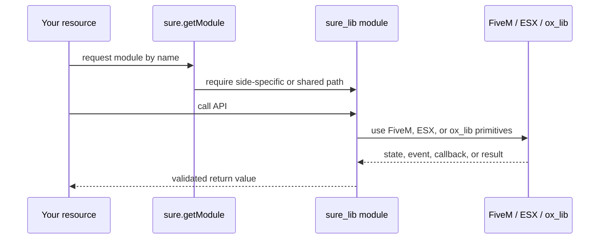

# Overview

sure_lib is a focused Lua 5.4 helper library for FiveM resources that use `ox_lib` and `es_extended`. It is designed around lazy module loading: a consuming resource imports one shared loader, then requests the module it needs through `sure.getModule(moduleName)`.

<CardGroup cols={3}>
  <Card title="Shared" icon="share-2" href="./validator.mdx">
    `validator`, `listener`, and `track` run on both client and server.
  </Card>
  <Card title="Client" icon="user" href="./player.mdx">
    `player` and client `cooldown` read live player and cooldown state.
  </Card>
  <Card title="Server" icon="server" href="./esx.mdx">
    `esx` and server `cooldown` apply authoritative gameplay changes.
  </Card>
</CardGroup>

## Module catalog

| Module | Side | Purpose |
| --- | --- | --- |
| `validator` | Shared | Runtime schema validation for objects, arrays, primitives, callbacks, ranges, and enums. |
| `listener` | Shared | Local and network event listeners with validator-backed argument checks. |
| `track` | Shared | Small reactive state primitive with dependency-based effects. |
| `player` | Client | Dynamic ESX player shortcuts, including inventory, accounts, loadout, ped, vehicle, and coords. |
| `cooldown` | Client and server | Synchronized position-keyed cooldown state with optional pause and reset behavior. |
| `esx` | Server | Safe transaction helpers for items and account money. |

<Tip>
  sure_lib does not load every module eagerly. Side-specific modules return `nil` when requested from the wrong runtime, which helps keep client/server boundaries clear.
</Tip>

## Repository shape

<Tree>
  <Tree.File name="fxmanifest.lua" />
  <Tree.File name="init.lua" />
  <Tree.Folder name="shared" defaultOpen>
    <Tree.File name="init.lua" />
    <Tree.Folder name="modules" defaultOpen>
      <Tree.Folder name="validator" defaultOpen>
        <Tree.File name="index.lua" />
      </Tree.Folder>
      <Tree.Folder name="listener">
        <Tree.File name="index.lua" />
      </Tree.Folder>
      <Tree.Folder name="track">
        <Tree.File name="index.lua" />
      </Tree.Folder>
    </Tree.Folder>
  </Tree.Folder>
  <Tree.Folder name="client" defaultOpen>
    <Tree.Folder name="modules">
      <Tree.Folder name="player">
        <Tree.File name="index.lua" />
      </Tree.Folder>
      <Tree.Folder name="cooldown">
        <Tree.File name="index.lua" />
      </Tree.Folder>
    </Tree.Folder>
  </Tree.Folder>
  <Tree.Folder name="server" defaultOpen>
    <Tree.Folder name="modules">
      <Tree.Folder name="esx">
        <Tree.File name="index.lua" />
      </Tree.Folder>
      <Tree.Folder name="cooldown">
        <Tree.File name="index.lua" />
      </Tree.Folder>
    </Tree.Folder>
  </Tree.Folder>
</Tree>

## How data moves

<Check>
  Use sure_lib when you want small runtime helpers without hiding the underlying FiveM and ESX concepts.
</Check>
